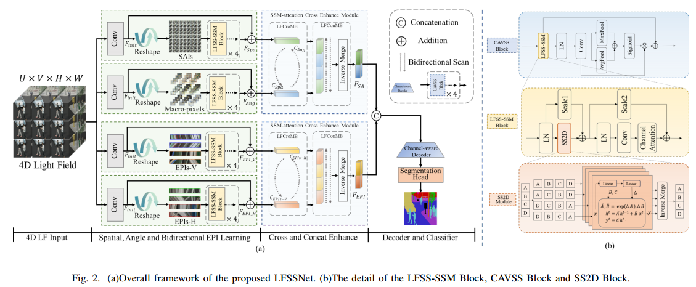
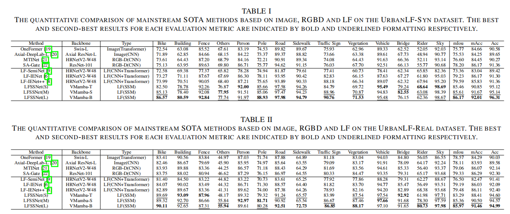

<h1> Consolidating Selective SSM with Spatial-Angular and Bidirectional Structural Fusion Perception for Light Field Semantic Segmentation </h1>

## 👀Introduction

With the advancement of neural networks and computational power, significant progress has been made in the research of light field semantic segmentation. However, existing
methods often face limitations in capturing long-range global dependencies or secondary computational complexities, which restricts performance. In this paper, we investigate the recently
proposed selective structural SSM and introduce LFSSNet, a novel Light Field full-aperture efficient Semantic Segmentation Network. We design four unique feature selective scanning modules specifically tailored to the inherent multi-dimensional spatialangular information and structural complementary information
of 4D complex light field data. These modules independently and efficiently extract spatial, angular, and bidirectional structural feature information from the 4D light field. Additionally, we
develop a fusion enhancement module based on the selective structural SSM, which further integrates the spatial-angular information and structural complementary information of the light
field, achieving interactive enhancement of the fused features. Extensive experiments conducted on synthetic and real-world datasets validate the state-of-the-art performance of the proposed
method, demonstrating that it can achieve high-precision semantic segmentation utilizing full-aperture light field information while maintaining low computational complexity.



## 📈Results

## 💡Environment

We test our codebase with `PyTorch 1.13.1 + CUDA 11.7`. Please install corresponding PyTorch and CUDA versions according to your computational resources. 

1. Create environment.
    ```shell
    conda create -n LFSSMam python=3.9
    conda activate LFSSNet
    ```

2. Install all dependencies.
Install pytorch, cuda and cudnn, then install other dependencies via:
    ```shell
    pip install torch==1.13.1+cu117 torchvision==0.14.1+cu117 torchaudio==0.13.1 --extra-index-url https://download.pytorch.org/whl/cu117
    ```
    ```shell
    pip install -r requirements.txt
    ```

3. Install Mamba
    ```shell
    cd models/encoders/selective_scan && pip install . && cd ../../..
    ```

## ⏳Setup

### Datasets

1. We use UrbanLF datasets, including both UrbanLF_Real and UrbanLF_Syn.

    Note: The central and peripheral views need to be extracted from the original data set and grayscale values processed on RGB labels

2. We provide the processed datasets we use here（only UrbanLF_Real）: [UrbanLF_Real_processed](https://www.hostize.com/v/gsCvymF8rP)

3. If you are using your own datasets, please orgnize the dataset folder in the following structure:
    ```shell
    <datasets>
    |-- <DatasetName1>
        |-- <DepthFolder>
            |-- <name1>.<ModalXFormat>
            |-- <name2>.<ModalXFormat>
            ...
        |-- <LFFolder>
            |-- <name1Folder>
               |-- <Image1>.<Image1Format>
               |-- <Image2>.<Image2Format>
               ...
               |-- <Image8>.<Image8Format>
            |-- <name2Folder>
        |-- <LabelFolder>
            |-- <name1>.<LabelFormat>
            |-- <name2>.<LabelFormat> 
            ...
        |-- train.txt
        |-- test.txt
    |-- <DatasetName2>
    |-- ...
    ```

    `train.txt/test.txt` contains the names of items in training/testing set, e.g.:

    ```shell
    <name1>
    <name2>
    ...
    ```

### Training

We will fully release the training process and code after acceptance.

### Evaluation

Currently, we only publicly release the optimal trained weights for UrbanLF_Real.

1.Please download the pretrained VMamba weights:

- [VMamba_Tiny](https://www.hostize.com/v/Pp_OQZ6SI5).
- [VMamba_Small](https://www.hostize.com/v/7uzMcGB6-u).
- [VMamba_Base](https://www.hostize.com/v/cKZgtMwmxf).

<u> Please put them under `pretrained/vmamba/`. </u>

2.Run the evaluation by:
   ```shell
    CUDA_VISIBLE_DEVICES="0/1/2/3/..." python eval.py -d="0" -n "dataset_name" -e="epoch_number" -p="visualize_savedir"
   ```

Here, `dataset_name=UbanLF_Real/UrbanLF_Syn`, referring to the datasets.\
`epoch_number` refers to a number standing for the epoch number you want to evaluate with.\
We provide the best `epoth.pth` of UrbanLF_Real in the [UrbanLF_Real_base_best](https://ufile.io/wf0kqqs8)/[UrbanLF_Real_small_best](https://ufile.io/yzw0fxyf)/[UrbanLF_Real_tiny_best](https://www.hostize.com/zh/v/Qz-Hce1WKe).\
You can replace `epoch_number` with `.log_final/log_UrbanLF_Real/epoth.pth`

3.Results will be saved in `visualize_savedir` and `visualize_savedir_color` folders.
